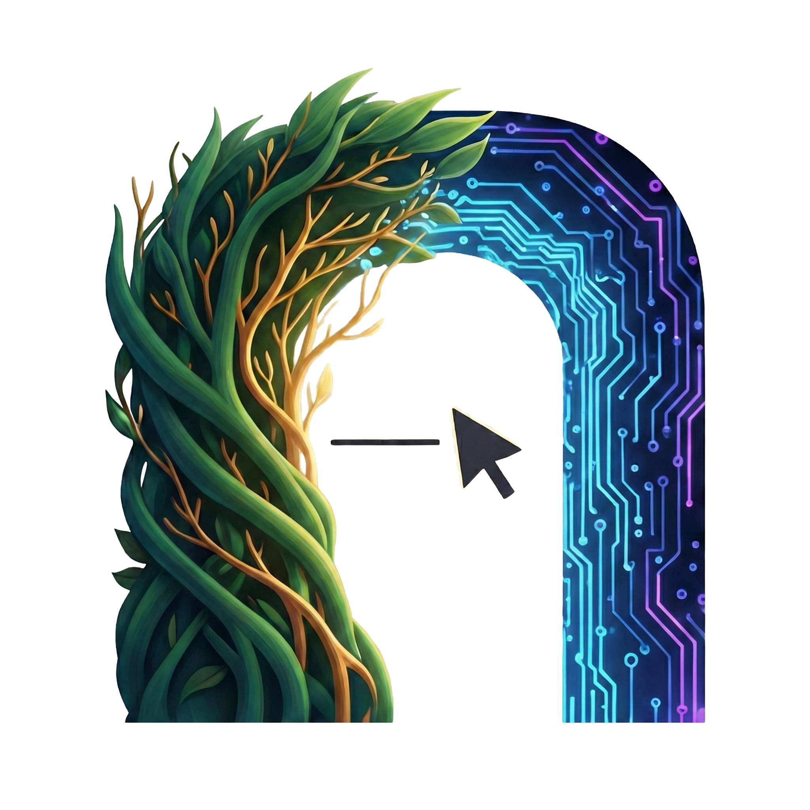
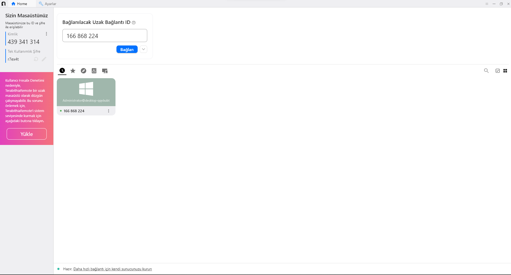
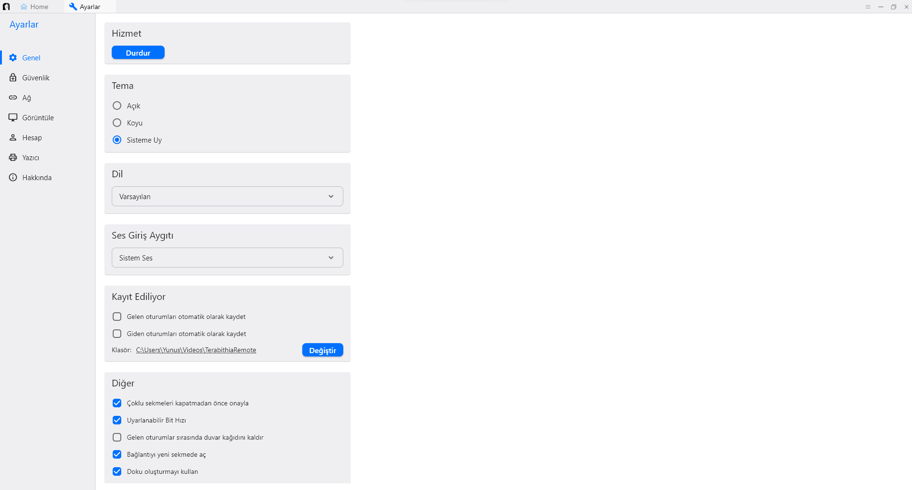
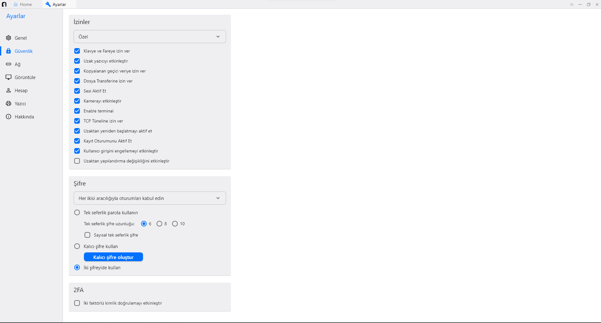
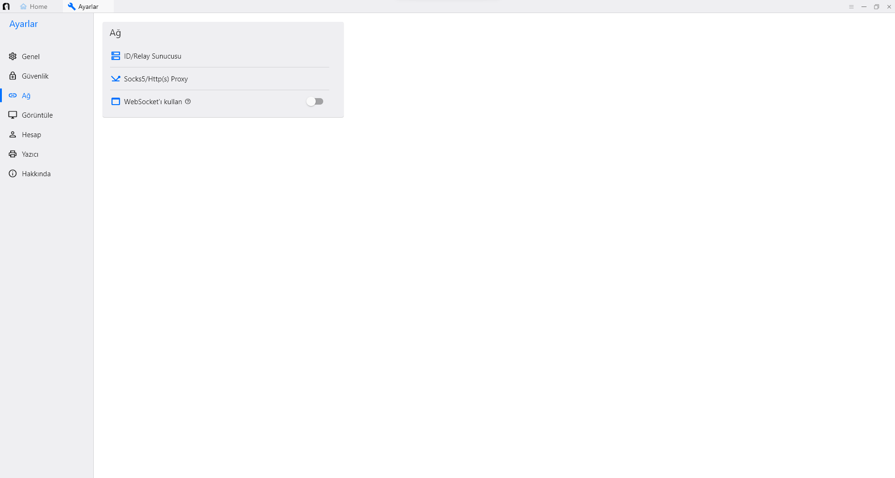
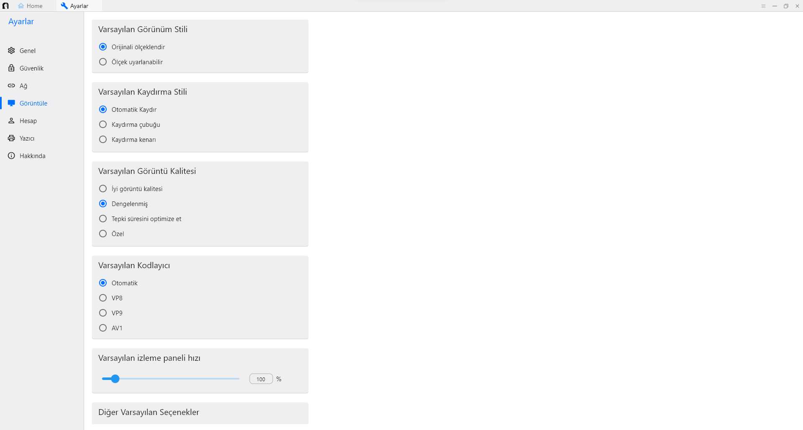
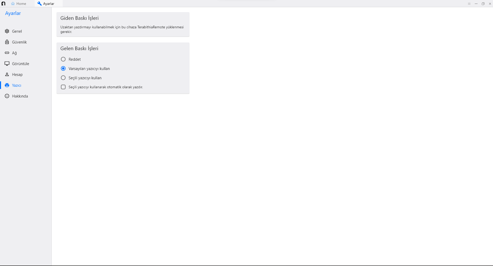
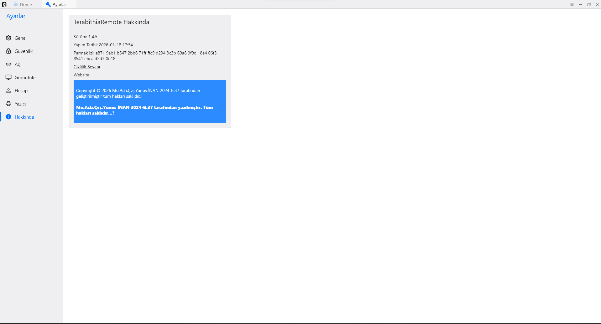

  

<h1 align="center">Terabithia Desktop</h1>

  RustDesk tabanlı özelleştirilmiş uzak masaüstü istemcisi 
  Windows odaklı, sade ve markalı bağlantı deneyimi

---

## 🎯 Amaç ve Kapsam

Bu çalışma:

- RustDesk tabanlı bir uzak bağlantı deneyimini
- Kişisel marka (Terabithia) altında
- Windows odaklı kullanım senaryoları için
- Kullanımı sadeleştirilmiş ve özelleştirilmiş bir biçimde sunmayı hedefler.

---

## 🖥️ Özellikler

- Uzak masaüstü bağlantısı
- ID + Parola ile bağlantı mantığı
- Dosya transferi
- Güvenlik izinleri
- Tema desteği (Sistem / Açık / Koyu)
- Görüntü ve kodlayıcı seçenekleri
- Yazıcı yönlendirme (Remote Print)
- Kayıt ve oturum izleme
- Self-host destekli kullanım (isteğe bağlı)

---

## 🛠️ Ekran Görüntüleri

---

## 🔧 Derleme / Geliştirme

Bu proje RustDesk’in derleme altyapısını temel alır.

Geliştirici ortamı için:

- Rust
- Flutter (Windows Desktop)
- Visual Studio / MSVC toolchain
- CMake

gereklidir.

---

## 🔐 Lisans ve Attribution

Bu proje, açık kaynaklı **RustDesk** projesinin bir türevidir.  
Orijinal proje ve lisans bilgilerine buradan erişilebilir:

> https://github.com/rustdesk/rustdesk

RustDesk, **AGPL-3.0 Lisansı** ile lisanslanmıştır.  
Bu nedenle bu çalışma da **AGPL-3.0** lisans koşullarını takip eder.

Telif ve attribution gereklilikleri açısından:

- Orijinal kaynak RustDesk’e aittir.
- Bu repo markalaştırılmış ve özelleştirilmiş bir türev çalışmadır.
- Ticari kullanım veya yeniden dağıtım planlarında AGPL-3.0 şartları geçerlidir.

Bu çalışma **öğrenme, deney ve kişisel kullanım senaryoları** üzerine tasarlanmıştır.

---

## 👤 Geliştirici

- Terabithia / Yunus
- GitHub: https://github.com/Terabithia1572

