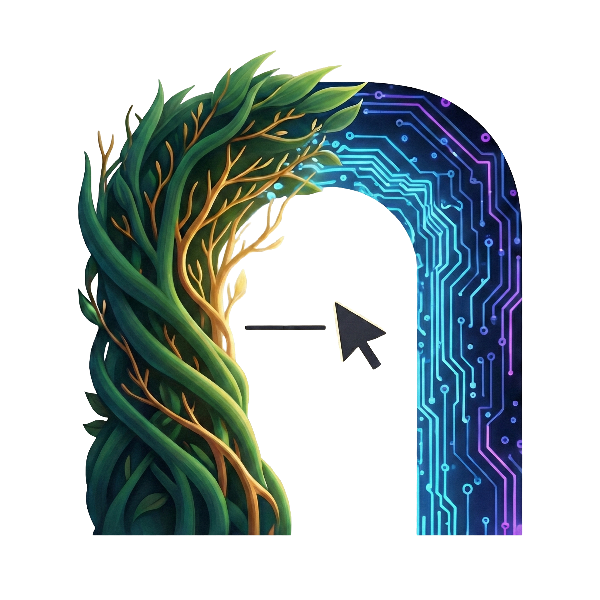
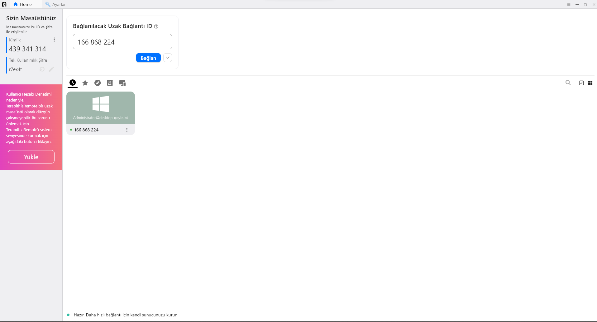
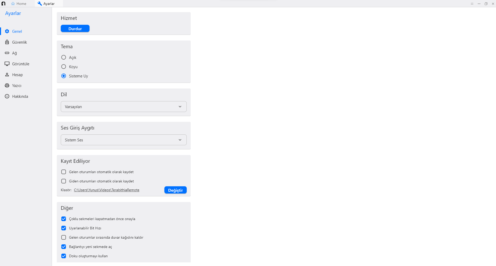
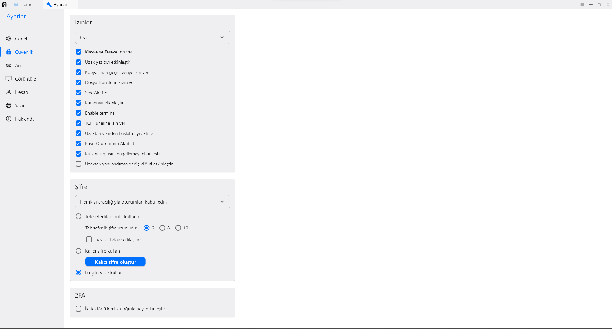
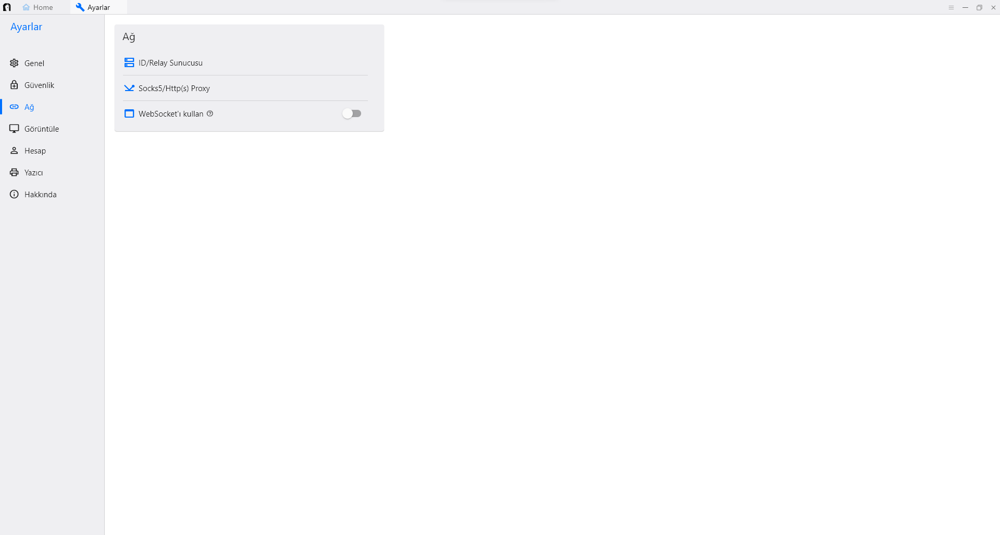
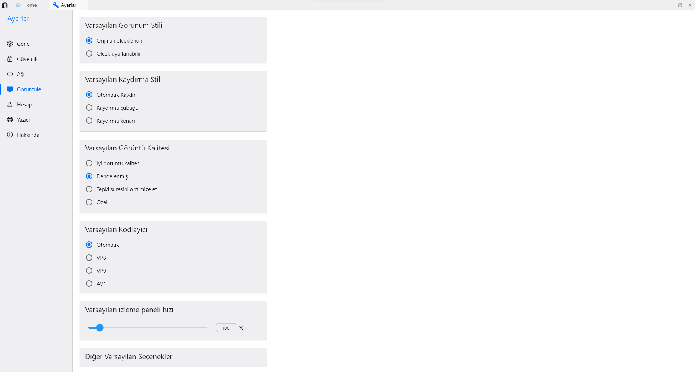
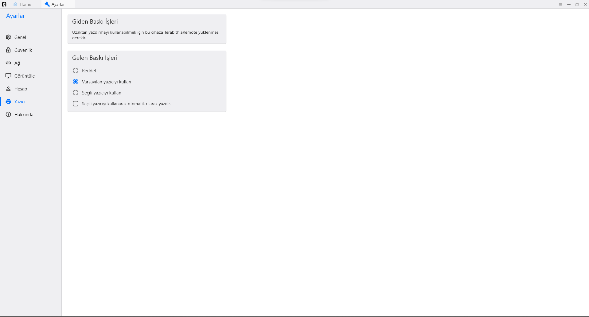
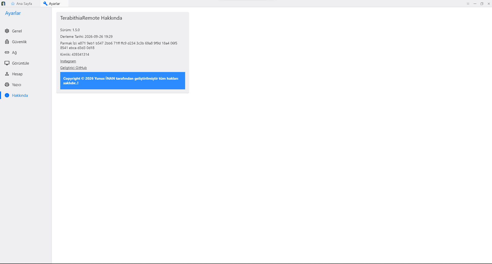

<p align="center">
  
</p>

<h1 align="center">TerabithiaRemote</h1>

<p align="center">
  RustDesk (v1.5.0) tabanlı özelleştirilmiş uzak masaüstü istemcisi<br>
  Windows odaklı, sade ve markalı bağlantı deneyimi
</p>

---

## 📥 İndirme ve Kurulum

TerabithiaRemote Windows yükleyicisi ve kaynak kodları bu depo üzerinden temin edilebilir:

- **Sürüm**: 1.5.0 (Upstream RustDesk `1.5.0` tabanlı)
- **Platform**: Windows x64

---

## 🎯 Amaç ve Kapsam

Bu çalışma:

- **RustDesk 1.5.0** tabanlı modern ve güvenli uzak bağlantı deneyimini
- Kişisel marka (**TerabithiaRemote**) altında
- Windows odaklı kullanım senaryoları için
- Kullanımı sadeleştirilmiş ve özelleştirilmiş bir biçimde sunmayı hedefler.

---

## 🖥️ Özellikler

- Uzak masaüstü bağlantısı
- ID + Parola ile bağlantı ve yetkilendirme
- Güvenli dosya transferi
- Güvenlik ve erişim izinleri yönetimi
- Koyu / Açık tema desteği
- Görüntü kalitesi ve codec ayarları
- Uzak yazıcı yönlendirme (Remote Printing)
- Oturum yönetimi ve kayıt imkanı

---

## 🛠️ Ekran Görüntüleri









---

## 🔧 Derleme / Geliştirme

Bu proje **RustDesk 1.5.0** derleme altyapısını temel alır.

Geliştirici ortamı gereksinimleri:

- **Rust** (1.75+)
- **Flutter** (Windows Desktop SDK)
- **Visual Studio / MSVC Toolchain**
- **LLVM / Clang & CMake**

Derleme komutu:

```powershell
python build.py --flutter
```

---

## 🔐 Lisans ve Attribution

Bu proje, açık kaynaklı **RustDesk** projesinin bir türevidir.  
Orijinal proje ve lisans bilgilerine buradan erişilebilir:

> https://github.com/rustdesk/rustdesk

RustDesk, **AGPL-3.0 Lisansı** ile lisanslanmıştır.  
Bu nedenle bu çalışma da **AGPL-3.0** lisans koşullarını takip eder.

Telif ve attribution gereklilikleri açısından:

- Orijinal kaynak kodu ve temel mimari **RustDesk** projesine aittir.
- Bu repo markalaştırılmış ve özelleştirilmiş bir türev çalışmadır.
- Ticari kullanım veya yeniden dağıtım planlarında AGPL-3.0 şartları geçerlidir.

---

## 👤 Geliştirici

- **Yunus İNAN**
- **GitHub Profile**: https://github.com/terabithia1572
- **Instagram**: https://www.instagram.com/yunusiinan/
